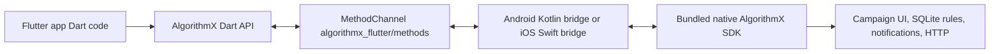

# How the Flutter plugin works

This document is for maintainers who want to change the plugin. The
[integration guide](INTEGRATION_GUIDE_FLUTTER.md) is for app developers.

## The three layers



The Dart API is in `lib/src/algorithmx.dart`. `AlgorithmX.instance` owns the
method channel and callback streams. The Kotlin and Swift bridges validate
named arguments, call the native SDK, and convert results to values supported
by Flutter's standard channel codec. The native SDK handles campaign UI,
database state, notification routing, and HTTP. Keep business behavior in the
native SDK rather than duplicating it in Dart.

## Why native source is bundled

The Android SDK in this repository is a Gradle module with no published Maven
coordinate. The iOS SDK is a Swift package with no CocoaPod release. A Flutter
plugin that merely names those dependencies would require each consuming app
to mount this monorepo in its native build. The plugin instead compiles copies
of their sources and resources:

- Android: `android/src/main/kotlin/algorithmx/engage` and
  `android/src/main/res`.
- iOS: `ios/algorithmx_flutter/Sources/algorithmx_flutter/NativeSDK`.

The native copies should be byte-for-byte identical to the sibling native
sources. Run `python3 tool/sync_native_sdks.py --check` before a release. Run
`--sync` after changing a native SDK, review the diff, and manually compare
the native Android manifest with the plugin's merged manifest. Never fix only
one vendored copy: patch the original native SDK first and resync.

The iOS Swift source has one canonical location. CocoaPods uses
`ios/algorithmx_flutter.podspec` and Swift Package Manager uses
`ios/algorithmx_flutter/Package.swift`; both compile that same source tree.
An app should not add the standalone native Android/iOS SDK alongside this
plugin, because the same class names would be compiled twice.

## One channel in both directions

All Dart-to-native calls send a method name plus a map of named arguments:

```dart
await channel.invokeMethod<void>('trackEvent', {
  'name': 'purchase',
  'properties': {'amount': 49.99},
});
```

The bridge reports a platform error for missing required fields and unknown
status values. Dart map/list contents must use values accepted by
`StandardMessageCodec`. The iOS bridge also converts Foundation values in
notification callback payloads to codec-safe values before sending them to
Dart. The Dart API exposes `Future` results even for native void methods, so
the caller can catch a channel error. A completed `Future<void>` is *not* an
HTTP delivery receipt: the native network dispatchers perform work later.

Native callbacks call methods on the same channel, such as
`onNotificationClick` and `onCampaignInteraction`. Dart has one registered
channel handler and dispatches each callback to a typed property and a
broadcast stream. A stream is observational; the callback property is the
place to return a bool when deciding whether an action was handled.

## Asynchronous Dart decisions and native fallback

The native notification routers ask `onNotificationClick` for a bool
**synchronously** before performing a default action. Dart callbacks can be
`async`, and blocking the platform main thread until Dart returns would
deadlock or freeze the app. The bridges use a continuation:

1. The native SDK records the notification open and campaign click.
2. The plugin's native listener returns `true` immediately, pausing the
   router's default action.
3. The plugin asks Dart `onNotificationClick` and waits for its reply without
   blocking the platform main thread.
4. If Dart returns `true`, the app has handled the action.
5. If Dart returns `false`, throws, is absent, or does not answer within five
   seconds after the engine is ready, the plugin performs only the default
   action branch. A cold-start tap can wait up to thirty seconds for Flutter
   startup before this Dart reply window begins. It does not
   call the full router again, so status and click are not tracked twice.

The Kotlin and Swift default branches mirror their native
`NotificationActionRouter` implementations. If a native router gains an
action type, update and test both plugin continuations. iOS action buttons
use the same idea: a false answer enters regular click handling once. The
Android native SDK currently ignores the action-button bool, and the Dart
documentation says so explicitly.

Deep links have no native automatic navigation. Their callbacks notify Dart;
the app's Flutter router handles the URL. The bool matters for a Dart-initiated
`openDeepLink` call and for the native interface contract, but there is no
browser fallback after a native-originated `open_screen` action.

## Startup and push lifecycle

Push can be delivered when a Flutter engine is absent. The platform host
therefore initializes the native SDK before forwarding a push:

- Android `Application.onCreate` and `FirebaseMessagingService` call
  `AlgorithmXFlutterPlugin.initializeForBackground(application, url, partnerId)` before
  `AlgorithmX.handleFcmMessage` or token registration. The Android bridge
  holds early tap callbacks until a Flutter engine attaches, with a bounded
  default-action timeout.
- iOS `AppDelegate` calls
  `AlgorithmXFlutterPlugin.initializeForBackground(apiBaseUrl: url, partnerId: id)` before
  forwarding APNs and notification response delegate methods. The iOS bridge
  also holds early callbacks for up to thirty seconds while Flutter starts.

The later Dart `initialize(apiBaseUrl: url, partnerId: id)` uses the same native
instance. Using a different URL or partner ID is an error, because silently
reinitializing would discard the existing queue and add duplicate lifecycle
observers.

The Android native SDK's lifecycle manager routes notification intents but
does not drain the campaign queue on foreground transitions. The Flutter
Android bridge supplies the missing `onAppBecameActive` and
`onAppWentBackground` calls using activity lifecycle callbacks. The iOS native
SDK observes `UIApplication` notifications itself. Neither platform should
use a Dart timer to poll the campaign queue.

Both platform bridges can receive multiple Flutter engines. The newest engine
that has called Dart `initialize` receives callbacks. When that engine detaches,
an earlier initialized engine resumes receiving them. An engine that has only
registered its plugin but has not started Dart does not consume callbacks.

The Android tap trampoline broadcasts a notification click before launching
the app's Activity. Its native lifecycle observer now recognizes a marker on
the launch Intent and skips the duplicate route; this keeps a killed-app tap
from being tracked twice.

## Public surface and native differences

The complete call and listener matrix is in [API and parity](API_AND_PARITY.md).
Platform-specific methods remain visibly platform-specific in Dart. For
example, `handleFcmMessage` is Android-only, while `handleNotification` and
`handleNotificationResponse` are iOS-only. This reflects the OS push APIs and
does not mean campaign capability is missing on either platform.

Two native legacy differences are preserved:

- Android `getQueueSize()` returns `0`, while iOS returns its WebView queue
  count. Dart adds `getWebViewQueueSize()` for a consistent meaning.
- iOS exposes WebView display success only internally, through its campaign
  controller. Android exposes a public method used by custom native displays.

## Contributor workflow

1. Read the original Android and iOS SDK method being wrapped. Do not infer
   its signature from the older React Native bridge; that bridge predates the
   native `AlgorithmX` rename.
2. Update `lib/src/algorithmx.dart` and its Dartdoc, both platform bridges,
   and the API matrix. If the feature exists on only one native platform,
   document that and return a platform error on the other.
3. If a native SDK changed, run the sync script and review its manifest and
   dependency changes. Keep native source copies aligned.
4. Run Dart format, analysis, and tests, then build the example for Android and
   iOS. Test push delivery on real devices with configured FCM/APNs.

The package has no external Dart runtime dependency beyond Flutter. Firebase
integration belongs to the host app so the plugin does not force a particular
Flutter messaging library on consumers.
